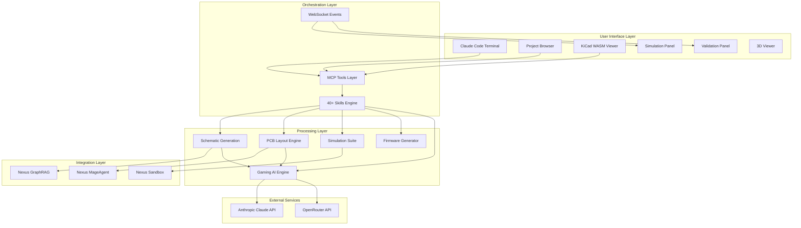
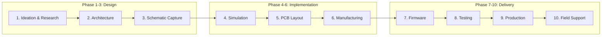
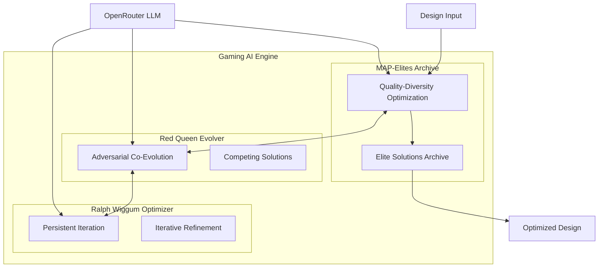
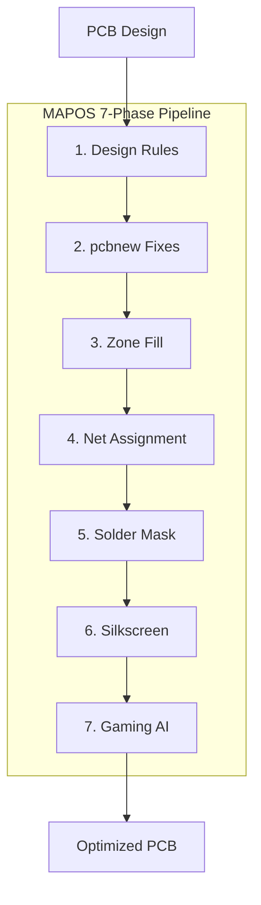
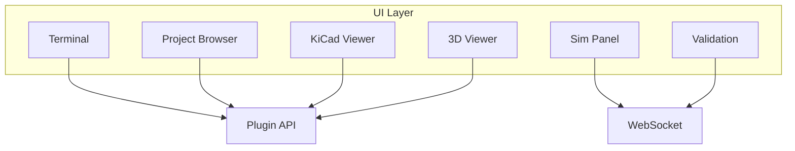
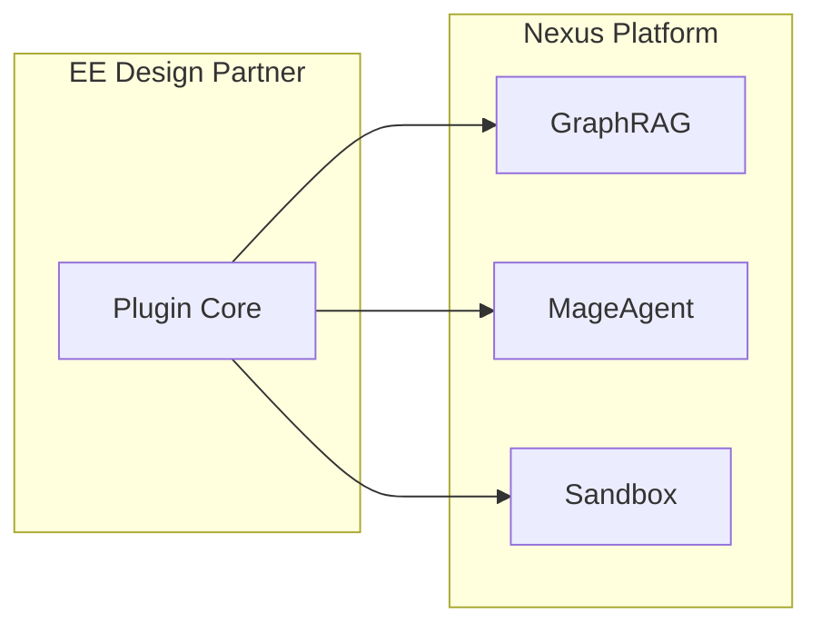
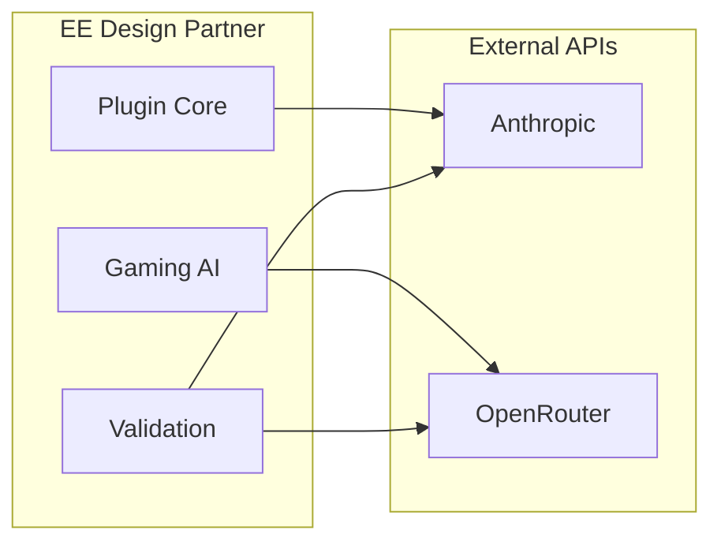
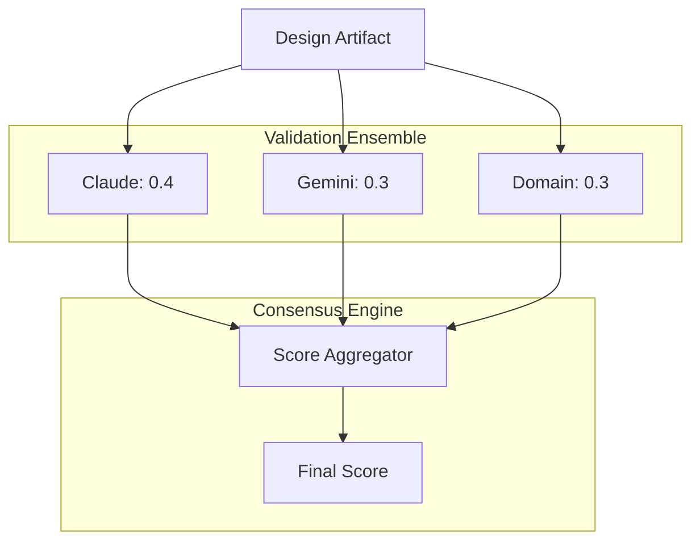
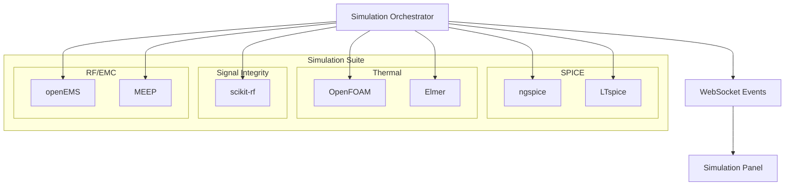

# EE Design Partner - Architecture Overview

System architecture documentation for the EE Design Partner plugin.

---

## System Overview

EE Design Partner is a Claude Code-driven electronic design automation (EDA) platform. The architecture centers on a terminal-first user experience with Claude Code as the central orchestrator.



---

## 10-Phase Pipeline

The EE Design Partner implements a comprehensive 10-phase pipeline for hardware development:



### Phase Details

| Phase | Name | Description | Associated Skills |
|-------|------|-------------|-------------------|
| 1 | Ideation & Research | Requirements gathering, patent search | `/research-paper`, `/patent-search` |
| 2 | Architecture | System design, component selection | `/ee-architecture`, `/component-select` |
| 3 | Schematic Capture | AI-generated schematics with Gaming AI | `/schematic-gen`, `/schematic-review` |
| 4 | Simulation | SPICE, Thermal, SI, RF/EMC | `/simulate-spice`, `/simulate-thermal`, `/simulate-si`, `/simulate-rf`, `/simulate-emc` |
| 5 | PCB Layout | Multi-agent tournament with Gaming AI | `/pcb-layout`, `/mapos` |
| 6 | Manufacturing | Gerber export, DFM, vendor quotes | `/gerber-gen`, `/dfm-check` |
| 7 | Firmware | HAL generation, RTOS config | `/firmware-gen`, `/hal-gen` |
| 8 | Testing | Test generation, HIL setup | `/test-gen`, `/hil-setup` |
| 9 | Production | Assembly guides, quality checks | `/manufacture`, `/quality-check` |
| 10 | Field Support | Debug assistance, service manuals | `/debug-assist`, `/service-manual` |

---

## Gaming AI Engine

The Gaming AI Engine brings techniques from game-playing AI to electronic design optimization:



### Algorithm Components

| Algorithm | Inspiration | Purpose | Key Feature |
|-----------|-------------|---------|-------------|
| **MAP-Elites** | Quality-Diversity | Maintain diverse elite solutions | Preserves high-quality solutions across behavior dimensions |
| **Red Queen** | Digital Red Queen | Adversarial co-evolution | Solutions compete and evolve against each other |
| **Ralph Wiggum** | Persistent iteration | Continuous optimization | File-based state with git integration |

### Gaming AI Features

- **LLM-First Mode**: OpenRouter Claude as primary intelligence (PyTorch optional)
- **Optional GPU Offloading**: RunPod, Modal, Replicate, Together AI
- **Multi-Objective Fitness**: 8-domain PCB scoring, 4-domain schematic scoring
- **Quality-Diversity Archive**: Preserves diverse high-quality solutions
- **Persistent Optimization**: File-based state, git integration

---

## MAPOS Pipeline

Multi-Agent PCB Optimization System (MAPOS) implements a 7-phase pipeline for DRC violation reduction:



### MAPOS Phase Details

| Phase | Name | Description |
|-------|------|-------------|
| 1 | Design Rules | IPC-2221 compliant .kicad_dru |
| 2 | pcbnew Fixes | Zone nets, dangling vias |
| 3 | Zone Fill | ZONE_FILLER API |
| 4 | Net Assignment | Orphan pad nets |
| 5 | Solder Mask | Via tenting, bridges |
| 6 | Silkscreen | Graphics to Fab layer |
| 7 | Gaming AI | MAP-Elites + Red Queen + Ralph Wiggum |

---

## UI Components

The plugin provides 6 UI components for interactive design:



### Component Details

| Component | Description | Type |
|-----------|-------------|------|
| terminal | Claude Code terminal integration | iframe |
| project-browser | VSCode-like GitHub repo browser | panel |
| kicad-viewer | KiCad WASM schematic and PCB editor | tab |
| simulation-panel | Simulation waveforms and results | panel |
| validation-panel | DRC/ERC/Multi-LLM validation results | panel |
| 3d-viewer | Three.js PCB 3D visualization | tab |

---

## Integration Points

### Nexus Services Integration



### External API Integration



---

## Multi-LLM Validation Architecture



---

## Simulation Architecture



### Simulation Capabilities

| Type | Engine | Capabilities |
|------|--------|--------------|
| SPICE | ngspice/LTspice | DC, AC, Transient, Monte Carlo, Noise |
| Thermal | OpenFOAM/Elmer | FEA, CFD, Steady-state, Transient |
| Signal Integrity | scikit-rf | Impedance, Crosstalk, Eye diagram |
| RF/EMC | openEMS/MEEP | Field patterns, S-parameters, Emissions |

---

## Project Structure

```
adverant-nexus-ee-design-partner/
├── services/nexus-ee-design/
│   ├── src/                           # TypeScript backend
│   │   ├── api/                       # REST API routes
│   │   ├── services/                  # Business logic
│   │   │   ├── schematic/             # Schematic generation
│   │   │   ├── pcb/                   # PCB layout, Ralph Loop
│   │   │   ├── simulation/            # Simulation orchestration
│   │   │   └── validation/            # Multi-LLM validation
│   │   └── types/                     # TypeScript definitions
│   └── python-scripts/
│       └── mapos/
│           ├── gaming_ai/             # Gaming AI for PCB
│           │   ├── config.py          # Centralized config
│           │   ├── llm_backends.py    # LLM replacements
│           │   ├── map_elites.py      # Quality-diversity
│           │   ├── red_queen_evolver.py
│           │   └── ralph_wiggum_optimizer.py
│           └── schematic_gaming_ai/   # Gaming AI for Schematics
│               ├── behavior_descriptor.py
│               ├── fitness_function.py
│               ├── mutation_operators.py
│               └── integration.py
├── ui/                                # Next.js dashboard
├── skills/                            # 40+ skill definitions
├── docs/                              # Documentation
│   ├── architecture.md
│   ├── gaming-ai.md                   # Gaming AI deep dive
│   └── use-cases.md                   # Use case examples
└── k8s/                               # Kubernetes manifests
```

---

## Additional Resources

- [QUICKSTART.md](QUICKSTART.md) - Installation and basic setup
- [USE-CASES.md](USE-CASES.md) - Real-world application examples
- [TECHNICAL.md](TECHNICAL.md) - API reference and configuration
