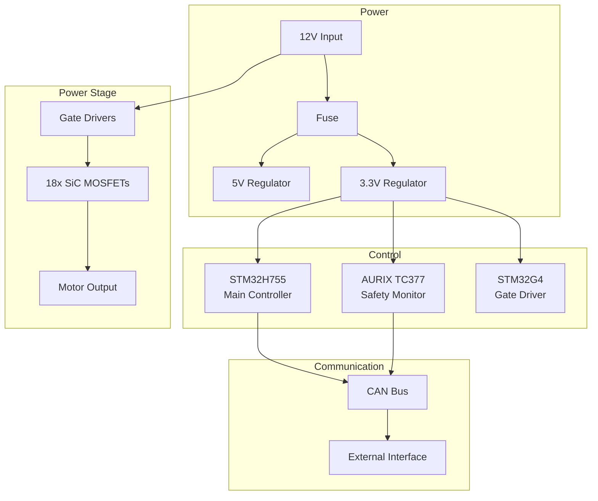

# EE Architecture Designer

## Overview

Generate comprehensive system architectures from natural language requirements. Produces block diagrams, power budgets, and interface specifications.

## Usage

### Generate Architecture

```bash
# From requirements
/ee-architecture "200A FOC ESC with triple redundant MCUs and CAN bus"

# With constraints
/ee-architecture "Battery-powered sensor node" --budget=$50 --size=50x50mm --power=100mW
```

### Generate Block Diagram

```bash
# Mermaid format
/ee-architecture diagram --project=proj-001 --format=mermaid

# Visual diagram
/ee-architecture diagram --project=proj-001 --format=svg
```

### Power Budget

```bash
# Generate power analysis
/ee-architecture power-budget --project=proj-001

# With operating modes
/ee-architecture power-budget --project=proj-001 --modes=active,sleep,standby
```

## Output Example

### Block Diagram (Mermaid)



### Power Budget

| Subsystem | Active | Sleep | Notes |
|-----------|--------|-------|-------|
| MCU Main | 150mA | 5µA | STM32H755 |
| MCU Safety | 80mA | 10µA | AURIX TC377 |
| Gate Drivers | 50mA | 0 | Per phase |
| CAN Transceivers | 60mA | 0 | 2x |
| Sensors | 20mA | 0 | Current sensors |
| **Total** | **360mA** | **15µA** | At 3.3V |

## API Endpoint

```
POST /ee-design/api/v1/architecture/generate
```

## Integration

Part of EE Design Partner Phase 2 (Architecture). Output feeds into:
- Component selection
- Schematic generation
- Power supply design
